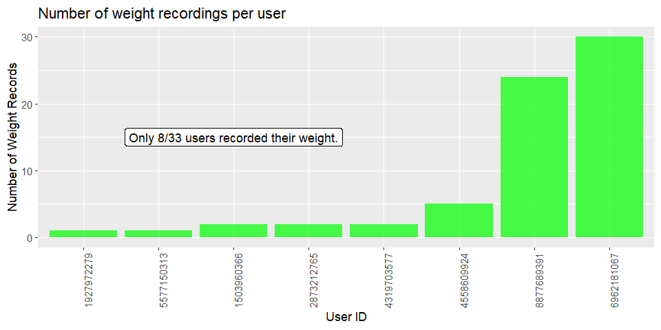

```{r setup, warning = FALSE, message=FALSE, include=FALSE}
knitr::opts_chunk$set(echo = TRUE)
```

# About Bellabeat
Bellabeat is a technology company founded by Urška Sršen and Sandro Mur that produces wearable devices targeted toward women. These devices are intended to provide women with data on activity, sleep, stress, and reproductive health, empowering them to make healthier life decisions. According to their website, a "massive majority of all products are created for and tested on men, then marketed to women." This means they have a good chance of being sub-optimal for women who buy them. As such, Bellabeat's mission is to provide women with devices made for them that can track menstrual cycles, as they play a huge role in a woman's health. 

# The objective
Sršen believes that by analyzing usage data from non-Bellabeat smart devices to understand how consumers use them, the marketing analytics division can come up with recommendations to direct future Bellabeat marketing strategies. 

# The data
This analysis was done with the [FitBit Fitness Tracker Data](https://www.kaggle.com/datasets/arashnic/fitbit) dataset, publicly available on the data-sharing website known as Kaggle.According to the Kaggle page, it consists of personal tracker data from 30 eligible and consenting Fitbit users shared via a distributed survey in Amazon Mechanical Turk, consisting of minute-to-minute physical activity, heart rate, steps, distance, and sleep monitoring. 

The dataset has 18 CSV files, all containing various combinations of these attributes. Because many of the files contain duplicate data, I chose the following 3 files which were the most relevant to my analysis: 

```{r warning = FALSE, message = FALSE, results = 'asis'}
library(tidyverse)
library(knitr)
dailyActivity <- read_csv("dailyActivity_merged.csv")
kable(head(dailyActivity), caption = "dailyActivity_merged.csv.")
```

```{r warning = FALSE, message = FALSE, results = 'asis'}
sleepDay <- read_csv("sleepDay_merged.csv")
kable(head(sleepDay), caption = "sleepDay_merged.csv.")
```
```{r warning = FALSE, message = FALSE, results = 'asis'}
weightLogInfo <- read_csv("weightLogInfo_merged.csv")
kable(head(weightLogInfo), caption = "weightLogInfo_merged.csv.")
```

## Limitations of the data
* Demographic info on the 30 users is not available, so many of the users may be men. This isn't ideal when analyzing data for insights on women's health products. 
* The data was generated in a short time frame (April 12th, 2016 to May 12th, 2016). 
* Users gathered their health data using a variety of different Fitbit trackers, each of which vary in features, adding an additional degree of variability to the data. 

## Cleaning the data
I took several steps to ensure the data was clean and in a usable format. 

### Removing entries with missing values
I tried running the following code to accomplish this: 

```{r} 
dailyActivity <- na.omit(dailyActivity)
sleepDay <- na.omit(sleepDay)
weightLogInfo <- na.omit(weightLogInfo)
```

However, attempting to remove entries with missing values from the `weightLogInfo` was problematic because 65 out of 67 entries had a missing fat value. This was presumably because users did not record their fat content when weighing themselves. 

The first two dataframes, `dailyActivity` and `sleepDay` were unaffected because they did not have any missing values. 

### Removing duplicate entries
I ran the following code to remove duplicate entries: 

```{r} 
dailyActivity <- distinct(dailyActivity)
sleepDay <- distinct(sleepDay)
weightLogInfo <- distinct(weightLogInfo)
```

`dailyActivity` and `weightLogInfo` were unaffected, but sleepDay lost 3 duplicate entries.

### Converting activity dates from string (text) to date format
I used the following code: `dailyActivity$ActivityDate <- as.Date(dailyActivity$ActivityDate)`, but the dates got messed up so I didn't continue with it. 

### Converting Id from numerical values to strings
I thought turning the numerical Id values to strings would ensure that they are not treated as numerical values on the x-axis when plotting data later, so I ran the following code: 

```{r}
dailyActivity$Id <- as.character(dailyActivity$Id)
sleepDay$Id <- as.character(sleepDay$Id)
weightLogInfo$Id <- as.character(weightLogInfo$Id)
```

### Removing the "12:00:00 AM" timestamp from the `SleepDay` variable in the `sleepDay` dataframe
This was redundant since we all know days start at 12:00 AM, so I ran this code to fix it: 

```{r}
sleepDay$SleepDay <- substr(sleepDay$SleepDay, start=1, stop=9)
```

# The analysis
In my analysis, there were several questions I wanted to answer, which I will illustrate below. 

### How many users wore their Fitbit device during the day on each day? 
I found that on every single day of data collection, more than half of the 33 users wore their device at some point in the day. 

```{r}
library(dplyr)
library(ggplot2)

# Filter out rows with 0 steps
filtered_data <- dailyActivity %>%
  filter(TotalSteps > 0)

# Group data by date and count the number of unique users
step_counts_by_date <- filtered_data %>%
  group_by(ActivityDate) %>%
  summarise(num_users = n_distinct(Id))

# Find what % of the time people were wearing their Fitbits overall
avg_users_per_day <- sum(step_counts_by_date$num_users)/31
overall_percent <- (avg_users_per_day/31)*100 
print(overall_percent)

# Create the bar plot
ggplot(step_counts_by_date, aes(x = reorder(ActivityDate, num_users))) +
  geom_bar(mapping=aes(y=num_users), stat = "identity", fill = "blue", alpha = 0.7) + 
  annotate(geom="label", 12, 12, label="On average, 89.8% of users 
           wore their Fitbits on any given day.", fill="white") +
  labs(title = "Number of Users who wore their Fitbit on each day",
       x = "Date",
       y = "Number of Users") +
  theme(axis.text.x = element_text(angle = 90))
```

As the graph shows, an average of 89.8% of users wore their Fitbit at some point during the day. <span style="color:red">This demonstrates that users are content to use their devices during the day to track their activity.</span>

### How many users wore their Fitbit device to bed each night? 
Next, I investigated how often users wore their devices at night. 

```{r}
# Analysis of sleep data

library(dplyr)

# Find how many users out of 33 recorded their sleep at least once
num_sleep_users <- sleepDay %>%
  summarise(num_unique = n_distinct(Id))
print(num_sleep_users)

# Find how many total sleep records were recorded by each user
total_sleep_records_per_id <- sleepDay %>%
  group_by(Id) %>%
  summarise(total_sleep_records = sum(TotalSleepRecords))

# Create the bar plot
ggplot(total_sleep_records_per_id, aes(x=reorder(Id, total_sleep_records))) +
  geom_bar(mapping=aes(y=total_sleep_records), stat = "identity", fill = "purple", alpha = 0.7) + 
  annotate(geom="label", 18, 12, label="Only 15/33 users recorded more than
           10 sleep sessions.", fill="white") +
  labs(title = "Number of sleep records for each user",
       x = "User ID",
       y = "Number of Sleep Records") +
  theme(axis.text.x = element_text(angle = 90))
```

I found that only 24/33 users recorded sleep, and of those, 9/24 recorded less than 10 sleep records during the 31-day period. This gets even worse when considering that some nights include multiple sleep records, so for several users, the number of nights they wore the tracker to bed is even less than the number of records. <span style="color:red">These are low numbers, suggesting many people don't want to wear their tracker to bed due to discomfort. 

### How many users used the weight-tracking, and how many did it manually? 
First, I calculated the percentage of weighs that were done manually. 

```{r, echo=FALSE, message=FALSE, results='hide'}
weightLogInfo <- read_csv("weightLogInfo_merged.csv")
```

```{r}
library(tidyverse)
library(dplyr)

# Find the proportion of weight logs that are done manually
num_manual_weighs <- sum(weightLogInfo$IsManualReport == TRUE, na.rm = TRUE)
percent_manual_weighs <- (num_manual_weighs/67)*100
print(percent_manual_weighs)
```

I found that ~61% of weighs are done manually, which suggests that manual weight tracking wasn't a problem for most people who used the weight-tracking feature. Additionally, 65/67 weight entries had no fat value, suggesting two possibilities: a) Most people used scales that didn't track fat composition, or b) They were using a scale that tracked fat but didn't sync to the Fitbit app automatically, so they were entering data manually and either forgot to or decided not to add fat values to their entry.

```{r}
# Find how many total weigh-ins were done by each user
weigh_id_counts <- table(weightLogInfo$Id)
weigh_id_counts <- as.data.frame(weigh_id_counts)
```

```{r, fig.show='hide', echo=TRUE}
# Create the bar plot
ggplot(weigh_id_counts, aes(x=reorder(Var1, Freq))) +
  geom_bar(mapping=aes(y=Freq), stat = "identity", fill = "green", alpha = 0.7) + 
  annotate(geom="label", 3, 15, label="Only 8/33 users recorded their weight.", fill="white") +
  labs(title = "Number of weight recordings per user",
       x = "User ID",
       y = "Number of Weight Records") +
  theme(axis.text.x = element_text(angle = 90))
```



Through further analysis, I found out that only 8/33 users recorded any weight data at all in Fitbit, and of those who did, 75% had less than 10 records. Clearly, manual tracking was fine for people who used it, but the problem is that hardly anyone did overall. 

Considering how important it is to track weight, I found it strange that so few users did so with their devices. It may suggest lack of access to a convenient scale to use. <span style="color:red">I believe that a convenient smart scale that auto-syncs with the Bellabeat app could be a great new product for Bellabeat to consider introducing to its customers.</span>

# Conclusion
It is abundantly clear that users liked wearing their devices during the day, as ~90% of them did on the average day. However, usage dropped off significantly at night, and considering how important sleep quality is for overall health, this is a problem. I think this is because the devices are not comfortable enough for people to want to wear them to bed. <span style="color:red"><b>Thus, comfort should be a top priority for Bellabeat when designing its own wearable devices for women's health. They should then run an ad campaign emphasizing the importance of quality sleep, and highlight how women can best achieve it with new-and-improved, ultra-comfortable Bellabeat trackers.</b></span>

Additionally, despite weight being a very important metric when tracking one's own health, weight tracking was barely utilized by the 33 users during this 31-day period. Less than 25% of users (8/33) even recorded their weight a single time, and only 25% of those (2/8) had more than 10 entries. Also, the vast majority of weight entries had no fat values, an important piece of sub-data relevant to weight. <span style="color:red"><b>This seems like an issue of convenience, so I believe Bellabeat should design and market a smart scale that tracks fat content and automatically syncs with their app.</b></span>

Ultimately, the key insight here is that users want a comfortable device that will passively collect all the health stats they care about. <b>Thus, comfort and convenience should be the #1 priority in Bellabeat's marketing strategy.</b>